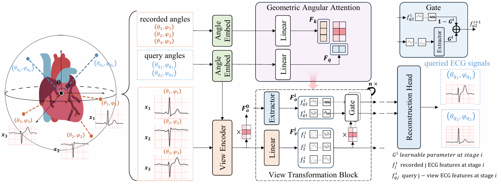
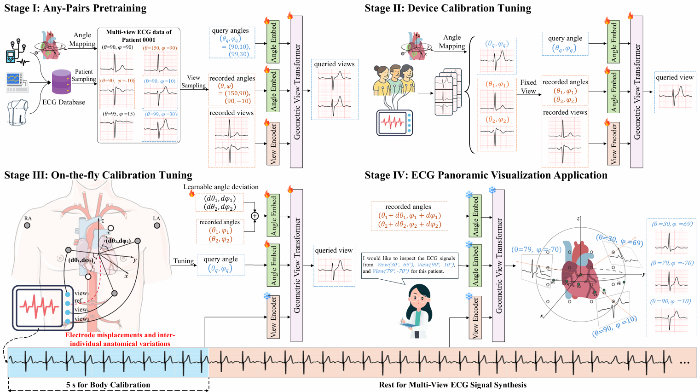
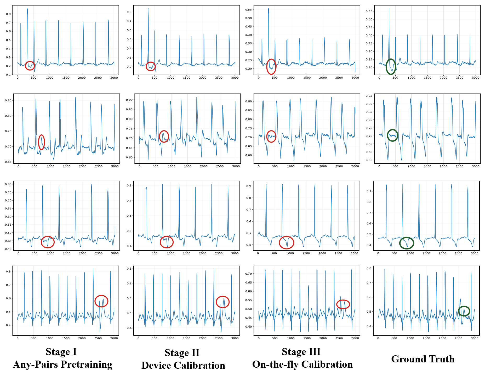

# NEF-NET v2: Adapting Electrocardio Panorama in the wild  
  
This repository contains the code and datasets for our ICLR 2026 paper [*NEF-NET v2: Adapting Electrocardio Panorama in the wild *](https://arxiv.org/pdf/2511.02880).  

If we view the human body as a precision machine, then the heart is its energy core. Every heartbeat is driven by an orderly propagation of electrical activity; on the body surface, this activity forms measurable potential distributions—i.e., the cardiac electric field. Observing this field from different spatial viewpoints yields different ECG leads, each reflecting the electrophysiological state of a particular region of the heart. The standard 12-lead ECG system most widely used in clinical practice gradually took shape in the mid-20th century, and the modern 12-lead framework became widely established after Goldberger introduced the augmented limb leads in 1942. This system is indispensable for diagnosing many cardiovascular conditions, yet its fixed and limited viewpoints inevitably create blind spots: for example, posterior-wall myocardial infarction often requires additional leads V7–V9 to more sensitively capture abnormalities, while Brugada syndrome may require moving precordial leads to the 2nd/3rd intercostal spaces to better reveal characteristic patterns. A more intuitive analogy is multi-view imaging: like photographing an object from different angles, nearby viewpoints are highly redundant, whereas sufficiently many diverse views can be combined into a more complete “3D” representation. Therefore, in principle, if we can learn the mapping relationships between views, we can infer and synthesize ECG signals at arbitrary viewpoints from a limited set of recorded leads.  

## NEF-NET v2 framework illustration  
  
  

## Illustration  
### An example illustrating  Electrocardio Panorama across training stages.:  
  
  

## How to use?  
* Prepare your env following requirements.txt  
  
     `pip install requirements.txt`  
  
 
  
## Citation  
  
**The code is just for reference.  This work is a continuation of the previous research "Electrocardio Panorama: Synthesizing New ECG Views with Self-supervision," and we look forward to future studies analyzing or synthesizing Electrocardio Panorama.**  
  
**The data we used is as follows:**
[Tianchi ECG dataset](https://tianchi.aliyun.com/competition/entrance/231754/information), [PTBXL Diagnostic ECG dataset](https://www.physionet.org/content/ptbdb/1.0.0/), [CPSC2018 ECG dataset](http://2018.icbeb.org/Challenge.html), [ChinaDB ECG dataset](https://www.nature.com/articles/s41597-020-0386-x#Sec9), [Panobench ECG dataset](
https://huggingface.co/datasets/whynotJunger/Panobench)

You can use the dataset in researches on Electrocardio Panorama and other ECG academic researches.  **Commercial purposes are not allowed.** As for the original ECG data and labels, please use them following their policy.  
  
Please cite the paper if the codes or the dataset we provided are helpful:  

> ```
>@inproceedings{
>anonymous2026nefnet,
>title={Nef-Net+: Adapting Electrocardio Panorama in the wild},
>author={Anonymous},
>booktitle={The Fourteenth International Conference on Learning Representations},
>year={2026},
>url={https://openreview.net/forum?id=JzZhhhxniR}
>}
> ```

